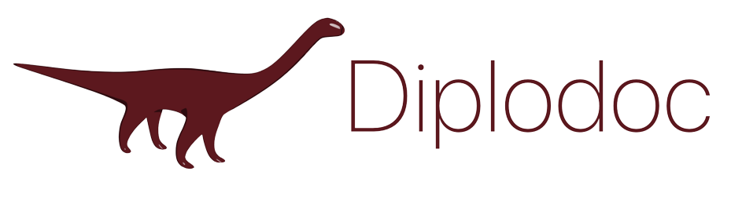

A collaborative document editor with real-time synchronization built as an academic project. The app implements Conflict-free Replicated Data Types (CRDTs) along with custom locking mechanisms and event loop. Built with Svelte for the frontend and Python for the backend, communicating via WebSockets.

# Setup

## diplodoc-server
```bash
cd diplodoc-server
uv sync
uv run python3 diplodoc/server.py
```

## diplodoc-client

Update `SERVER_URL` in `diplodoc-client/src/App.svelte` to match your server's ip.
```bash
cd diplodoc-client
npm install
HOST=0.0.0.0 npm run dev
```
